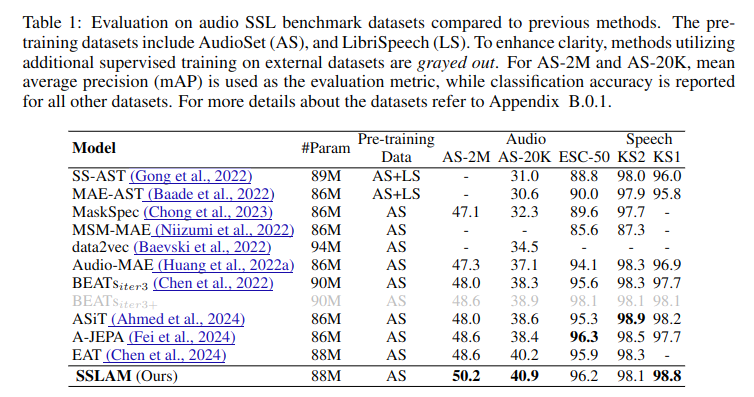
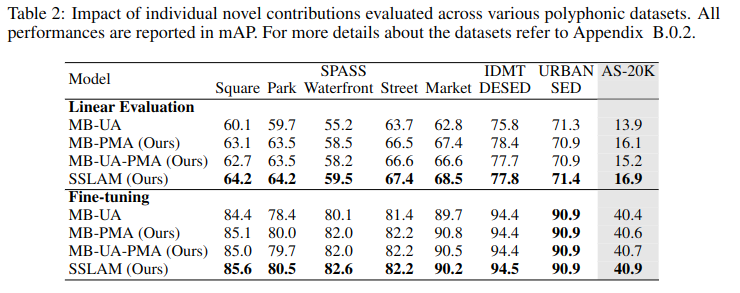

# 🔊 [ICLR 2025] SSLAM: Enhancing Self-Supervised Models with Audio Mixtures for Polyphonic Soundscapes

[](https://openreview.net/forum?id=odU59TxdiB)

🚀 **SSLAM** is a self-supervised learning framework designed to enhance audio representation quality for both **polyphonic(multiple overlapping sounds)** and monophonic soundscapes. Unlike traditional SSL models that focus on monophonic data, SSLAM introduces a novel **source retention loss** and **audio mixture training**, significantly improving performance on real-world polyphonic audio.

🔗 **[Paper](https://openreview.net/pdf?id=odU59TxdiB) | [Open Review](https://openreview.net/forum?id=odU59TxdiB) | [Pre-trained Models](https://drive.google.com/drive/folders/1G0icv-hdqDEqnfP4EFszMXhFnWWM09gT?usp=sharing)**

---

## 🔍 Why SSLAM?
🔊 **Real-world audio is polyphonic**—multiple overlapping sound sources are common in everyday environments.  
❌ **Existing SSL models focus on monophonic audio,** limiting their ability to generalize to real-world scenarios. Their benchmarks are primarily monophonic, and their pre-training does not account for polyphonic environments.   
💡 **SSLAM bridges this gap** by introducing **self-supervised learning from audio mixtures**, enabling robust learning across **both monophonic and polyphonic soundscapes**.

---

## 🎼 Key Features
✅ **Self-Supervised Learning from Audio Mixtures (SSLAM)** – improving robustness to real-world polyphonic audio  (multiple overlapping sounds).  
✅ **Source Retention Loss** – ensures the integrity of each sound source even in complex mixtures.  
✅ **SOTA Performance** – Achieves **+3.9% mAP improvement** on AudioSet-2M and **+9.1% on polyphonic datasets**.  

---
## 📊 Results

### 1. Standard Audio-SSL Benchmark


### 2. Polyphonic Datasets


---
## **🛠️Inference Mode**
> **Note**: If you are already using [EAT](https://github.com/cwx-worst-one/EAT/tree/main) in your evaluation/inference pipeline, you can simply replace the weights with SSLAM weights, as the inference and evaluation code is identical to EAT.

If not, follow the steps below for installation:
## 📥 Inference Installation

```bash
conda create --prefix /path/to/sslam_eval_env -y python=3.9.13
/path/to/sslam_eval_env/bin/python -m pip install pip==24.0 # downgrade pip
/path/to/sslam_eval_env/bin/pip install -r SSLAM_Inference/requirements_sslam_eval.txt
```
---

## 📦 Model Weights

| Model Type               | Link                                                                                       |
|--------------------------|--------------------------------------------------------------------------------------------|
| **Pre-Trained**          | [Download](https://drive.google.com/drive/folders/1aA65-qQCHSCrkiDeLGUtn1PiEjJi5HS8?usp=sharing) |
| **AS2M Fine-Tuned** (50.2 mAP) | [Download](https://drive.google.com/drive/folders/1Yy38IyksON5RJFNM7gzeQoAOSPnEIKp2?usp=sharing) |
---

#### 🚀 **Using SSLAM**

We provide scripts to use SSLAM in the following ways:

##### 1. **Audio Feature (Representation) Extraction Using SSLAM Encoder**

```bash
cd SSLAM_Inference/scripts
bash feature_extract.sh
```

##### 2. **Inference on Single Audio WAV File**

```bash
cd SSLAM_Inference/scripts
bash inference.sh
```

##### 3. **Evaluation on AudioSet-2M Evaluation Set**

```bash
cd SSLAM_Inference/scripts
bash evaluate_AS2M_finetuned.sh # Reported mAP: 50.2
```

---


## 📌 Checklist 
- [x] Inference Mode
- [ ] Pre-Training

---

## 🙏 Acknowledgements

Our code is primarily based on [EAT](https://github.com/cwx-worst-one/EAT/tree/main) and [data2vec 2.0](https://github.com/facebookresearch/fairseq/tree/main/examples/data2vec)  with additional concepts and components adapted from  [AudioMAE](https://github.com/facebookresearch/AudioMAE).


## 📜 Citation

If you find our work useful, please cite it as:  

```bibtex
@inproceedings{alex2025sslam,
  title={{SSLAM}: Enhancing Self-Supervised Models with Audio Mixtures for Polyphonic Soundscapes},
  author={Tony Alex and Sara Atito and Armin Mustafa and Muhammad Awais and Philip J B Jackson},
  booktitle={The Thirteenth International Conference on Learning Representations},
  year={2025},
  url={https://openreview.net/forum?id=odU59TxdiB}
}